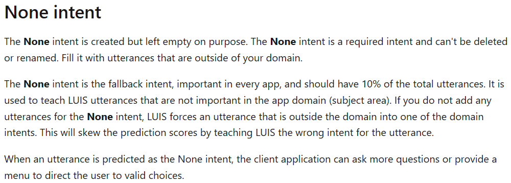
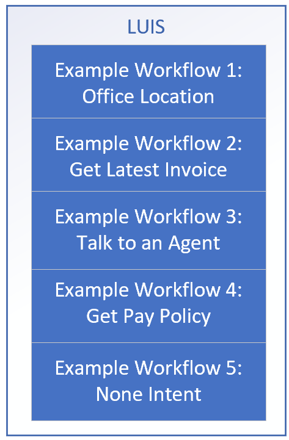
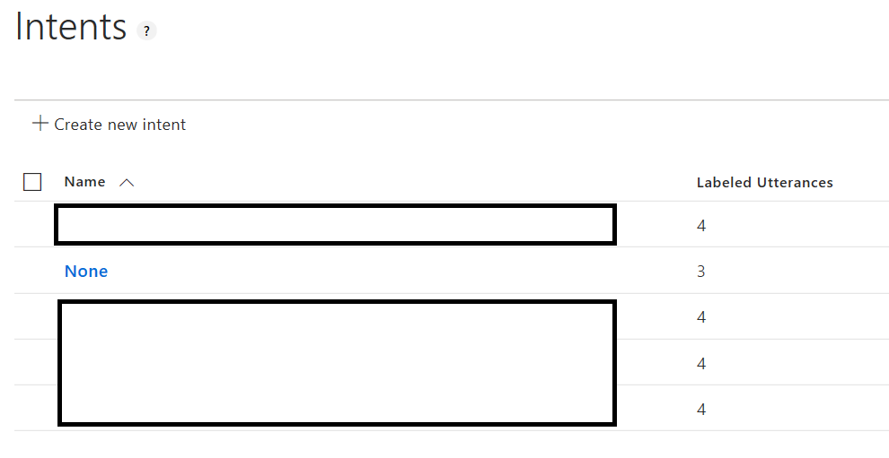

## Add Example Utterances to None Intent

Assuming we have an idea of what intents (and potentially entities) we'd like to detect, we can look into training a LUIS model using the portal.

We can utilize this [Getting Starting](https://docs.microsoft.com/en-us/azure/cognitive-services/luis/get-started-portal-build-app) guide for creating a LUIS model in the portal.

The main concept here from the [LUIS Best Practices Guidance](https://docs.microsoft.com/en-us/azure/cognitive-services/LUIS/luis-concept-best-practices#do-add-example-utterances-to-none-intent):
> This intent is the fallback intent, indicating everything outside your application. Add one example utterance to the None intent for every 10 example utterances in the rest of your LUIS app.

### Helpful Links
1. [Getting Started With LUIS](https://docs.microsoft.com/en-us/azure/cognitive-services/luis/get-started-portal-build-app)
1. [Tutorial for LUIS with C# Bot Framework](https://docs.microsoft.com/en-us/azure/cognitive-services/luis/luis-csharp-tutorial-bf-v4)
1. [LUIS Best Practices Guidance](https://docs.microsoft.com/en-us/azure/cognitive-services/LUIS/luis-concept-best-practices#do-add-example-utterances-to-none-intent)
1. [Intents](https://docs.microsoft.com/en-us/azure/cognitive-services/luis/luis-concept-intent)
1. [Utterances](https://docs.microsoft.com/en-us/azure/cognitive-services/luis/luis-concept-utterance)
1. [Entities](https://docs.microsoft.com/en-us/azure/cognitive-services/luis/luis-concept-entity-types)
1. [None Intent](https://docs.microsoft.com/en-us/azure/cognitive-services/LUIS/luis-concept-intent#none-intent)
1. [LUIS Development Lifecycle](https://docs.microsoft.com/en-us/azure/cognitive-services/luis/luis-concept-app-iteration)

### Setup LUIS Model

We have included a sample LUIS model, but we'll assume that we're going to start with a brand new one.

#### Some Concepts and Design

First, determine some example [Utterances](https://docs.microsoft.com/en-us/azure/cognitive-services/luis/luis-concept-utterance), [Intents](https://docs.microsoft.com/en-us/azure/cognitive-services/luis/luis-concept-intent), and even [Entities](https://docs.microsoft.com/en-us/azure/cognitive-services/luis/luis-concept-entity-types).  In this scenario, we'll start simple with some **utterances** and **intents** we'd like LUIS to detect.

It's also good to cover how to use the 
[None Intent](https://docs.microsoft.com/en-us/azure/cognitive-services/LUIS/luis-concept-intent#none-intent).  Specifically, the docs cover that the none intent is to be 'filled with utterances that are outside of your domain'.

For example, suppose we want to detect some intents like location, get invoice, talk to an agent, or get pay policy.

It would also be helpful to think about representative utterances (e.g. this is what a user will send to a LUIS model through a chatbot) to populate the LUIS model.  We can use these utterances when we create the LUIS model.

We'll want to populate varied utterances that we think users will enter, and we can also **later** add in actual user utterances to map to the appropriate intent.  In this case, we want to map utterances to the None Intent that are not related to the domain.  Also, we can add additional utterances such that the None intent's utterances represents 10% of the total utterances.

We'll start with a smaller amount of utterances, train, and review endpoint utterances for correct intent prediction.

> Note, while we're adding utterances here in the portal, if it's preferred, we can also update a json version of the model.  This may be a choice for bootstrapping authoring vs. having a longer term solution for content maintenance.