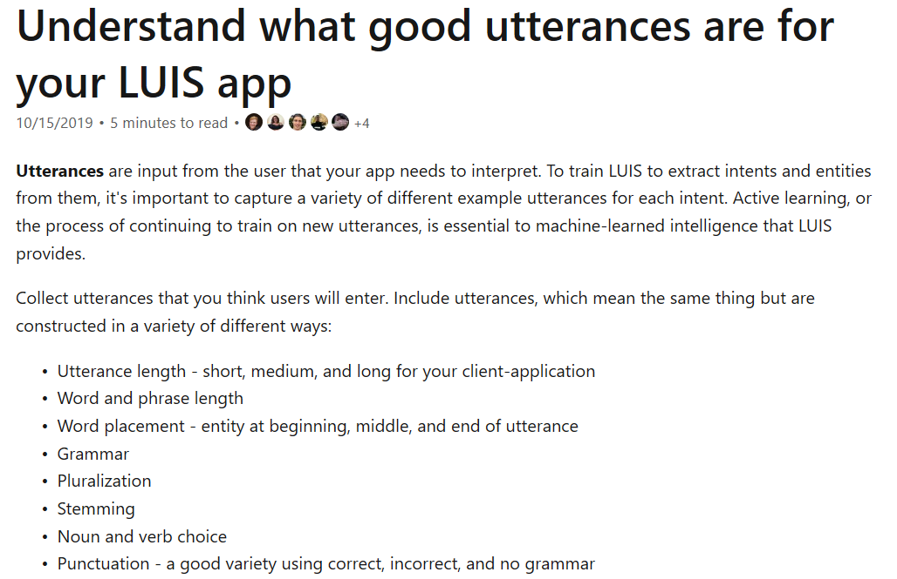
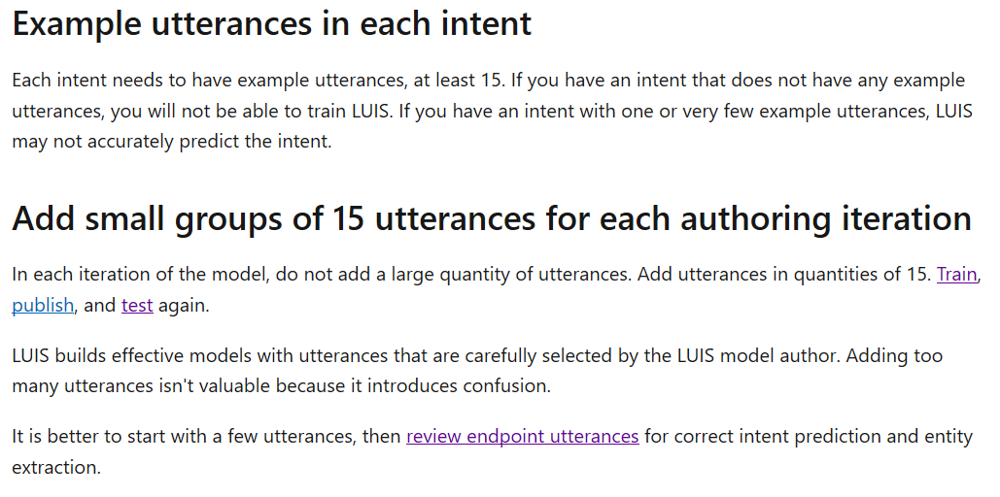
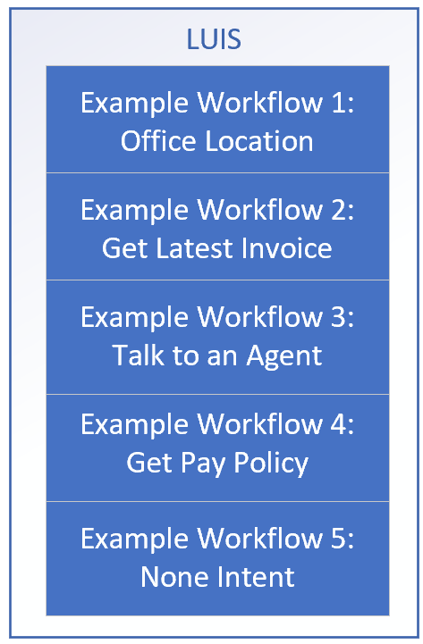
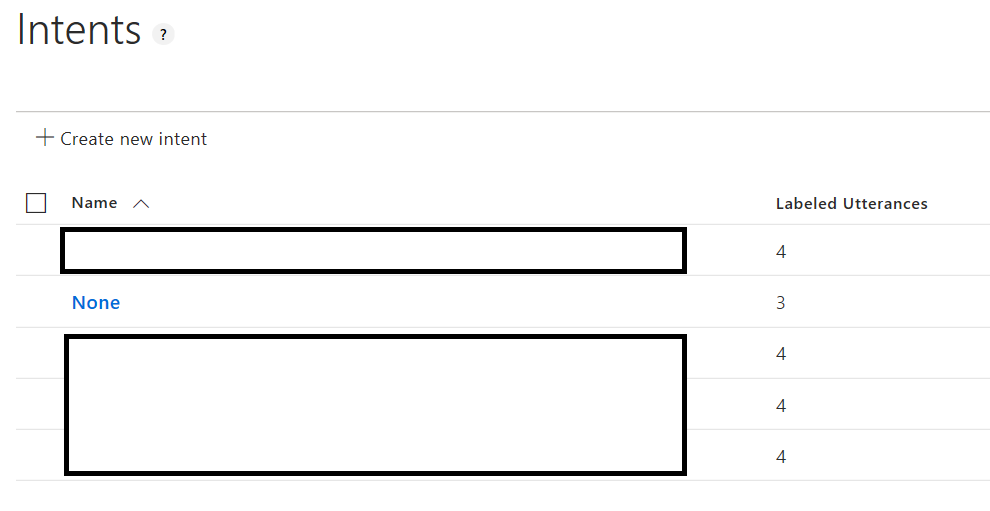

## Balance Utterances Across All Intents

Assuming we have an idea of what intents (and potentially entities) we'd like to detect, we can look into training a LUIS model using the portal.

We can utilize this [Getting Starting](https://docs.microsoft.com/en-us/azure/cognitive-services/luis/get-started-portal-build-app) guide for creating a LUIS model in the portal.

The main concept here from the [LUIS Best Practices Guidance](https://docs.microsoft.com/en-us/azure/cognitive-services/luis/luis-concept-best-practices#do-balance-your-utterances-across-all-intents):
> In order for LUIS predictions to be accurate, the quantity of example utterances in each intent (except for the None intent), must be relatively equal.
If you have an intent with 100 example utterances and an intent with 20 example utterances, the 100-utterance intent will have a higher rate of prediction.

### Helpful Links
1. [Getting Started With LUIS](https://docs.microsoft.com/en-us/azure/cognitive-services/luis/get-started-portal-build-app)
1. [LUIS Best Practices Guidance](https://docs.microsoft.com/en-us/azure/cognitive-services/luis/luis-concept-best-practices#do-balance-your-utterances-across-all-intents)
1. [Intents](https://docs.microsoft.com/en-us/azure/cognitive-services/luis/luis-concept-intent)
1. [Utterances](https://docs.microsoft.com/en-us/azure/cognitive-services/luis/luis-concept-utterance)
1. [Entities](https://docs.microsoft.com/en-us/azure/cognitive-services/luis/luis-concept-entity-types)
1. [LUIS Development Lifecycle](https://docs.microsoft.com/en-us/azure/cognitive-services/luis/luis-concept-app-iteration)

### Setup LUIS Model

We have included a sample LUIS model, but we'll assume that we're going to start with a brand new one.

#### Some Concepts and Design

First, determine some example [Utterances](https://docs.microsoft.com/en-us/azure/cognitive-services/luis/luis-concept-utterance), [Intents](https://docs.microsoft.com/en-us/azure/cognitive-services/luis/luis-concept-intent), and even [Entities](https://docs.microsoft.com/en-us/azure/cognitive-services/luis/luis-concept-entity-types).  In this scenario, we'll start simple with some **utterances** and **intents** we'd like LUIS to detect.

Also, from the same doc, it's worth understanding that we should **use the representative language of the user:**
When choosing utterances, be aware that what you think is a common term or phrase might not be correct for the typical user of your client application. They may not have domain experience. Be careful when using terms or phrases that a user would only say if they were an expert.

For example, suppose we want to detect some intents like location, get invoice, talk to an agent, or get pay policy.

It would also be helpful to think about representative utterances (e.g. this is what a user will send to a LUIS model through a chatbot) to populate the LUIS model.  We can use these utterances when we create the LUIS model.

We'll want to populate varied utterances that we think users will enter, and we can also **later** add in actual user utterances to map to the appropriate intent.  The idea here is to have a good set of utterances in relative quantities for each intent.

We'll start with a smaller amount of utterances, train, and review endpoint utterances for correct intent prediction.

> Note, while we're adding utterances here in the portal, if it's preferred, we can also update a json version of the model.  This may be a choice for bootstrapping authoring vs. having a longer term solution for content maintenance.