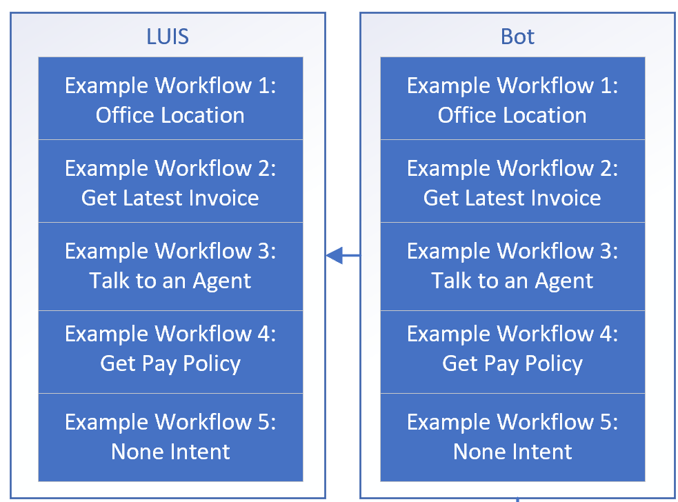
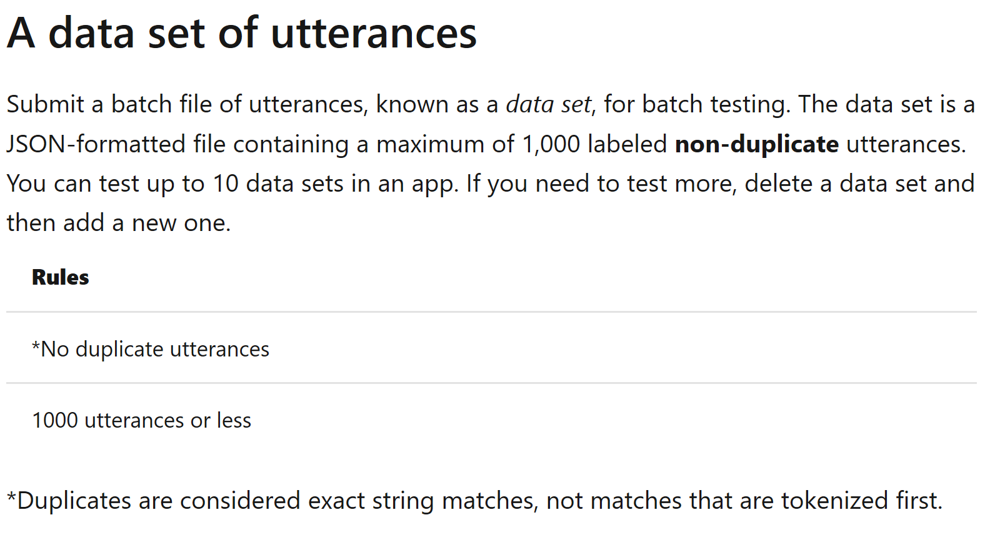
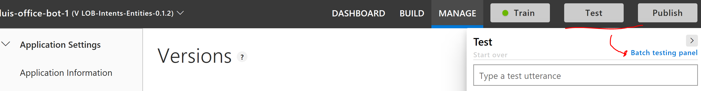
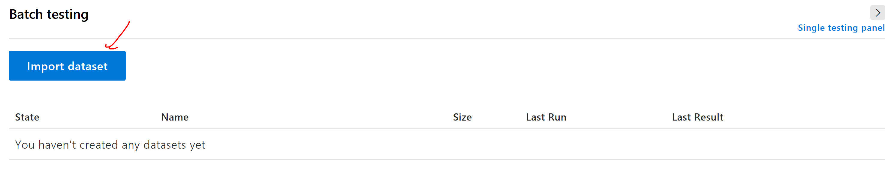
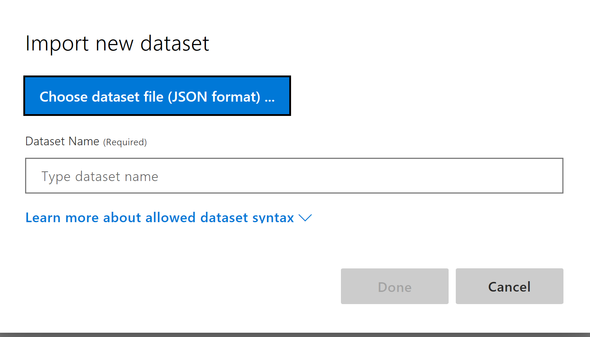
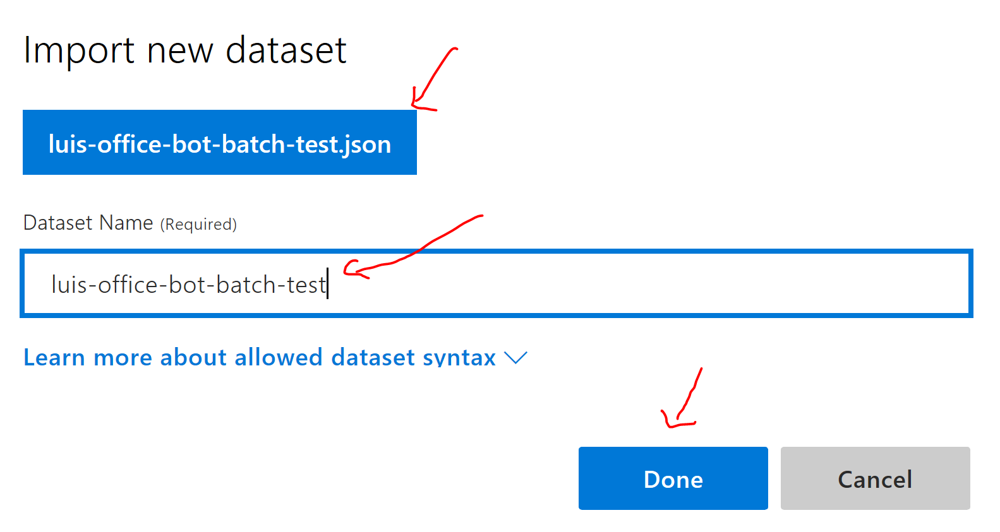
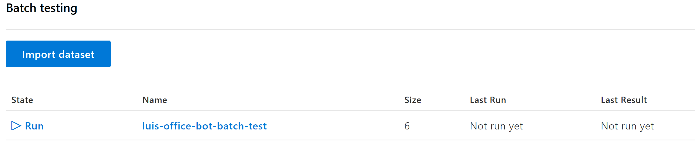
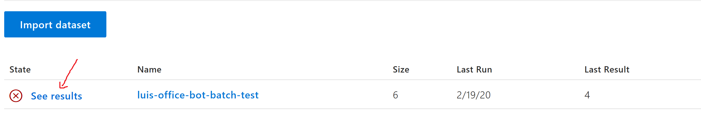
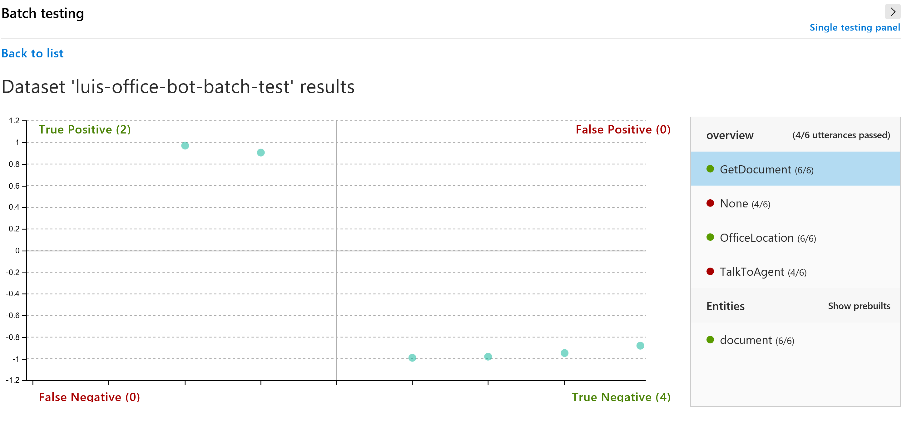
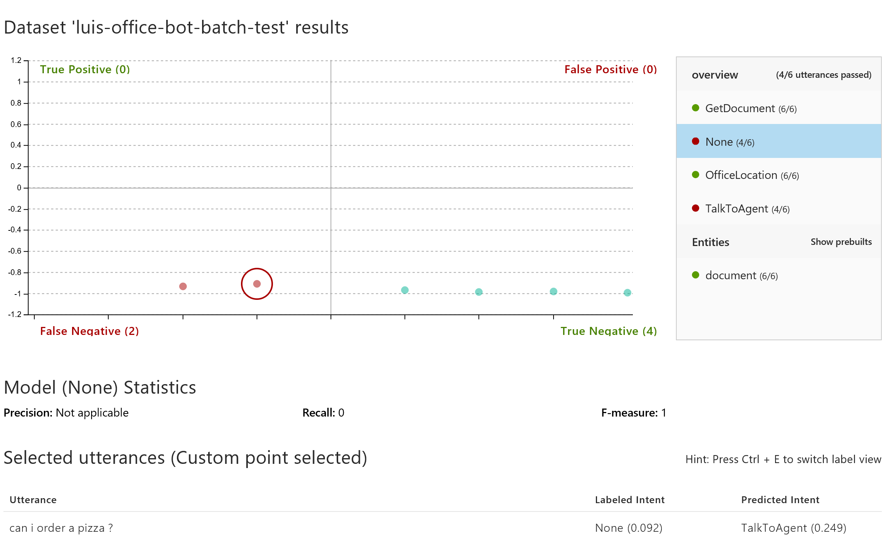

### Batch Testing

Assuming we have already [trained a model](./README-LUIS-Training-Portal.md), we can look into testing the model as well.

Another concept to consider from [LUIS Best Practices Guidance](https://docs.microsoft.com/en-us/azure/cognitive-services/luis/luis-concept-best-practices#do-monitor-the-performance-of-your-app):

>Monitor the prediction accuracy using a [batch test](https://docs.microsoft.com/en-us/azure/cognitive-services/luis/luis-concept-batch-test) set.
Keep a separate set of utterances that aren't used as example [utterances](https://docs.microsoft.com/en-us/azure/cognitive-services/luis/luis-concept-utterance) or endpoint utterances. Keep improving the app for your test set. Adapt the test set to reflect real user utterances. Use this test set to evaluate each iteration or version of the app.

We'll look to apply [a batch test](https://docs.microsoft.com/en-us/azure/cognitive-services/luis/luis-how-to-batch-test) to our example scenario.

For a walkthrough of working with batch testing and a sample of working through the testing results, we can also refer to this [Batch Testing Tutorial](https://docs.microsoft.com/en-us/azure/cognitive-services/luis/luis-tutorial-batch-testing).

#### Helpful Links
1. [Batch Testing Tutorial](https://docs.microsoft.com/en-us/azure/cognitive-services/luis/luis-tutorial-batch-testing)
1. [Phrase Lists](https://docs.microsoft.com/en-us/azure/cognitive-services/luis/luis-how-to-add-features)
1. [How to Batch Test](https://docs.microsoft.com/en-us/azure/cognitive-services/luis/luis-how-to-batch-test)
1. [Features](https://docs.microsoft.com/en-us/azure/cognitive-services/luis/luis-concept-feature)
1. [Batch Test Concept](https://docs.microsoft.com/en-us/azure/cognitive-services/luis/luis-concept-batch-test)
1. [Importing Batch Test Common Errors](https://docs.microsoft.com/en-us/azure/cognitive-services/luis/luis-concept-batch-test#common-errors-importing-a-batch)
1. [LUIS Best Practices Guidance](https://docs.microsoft.com/en-us/azure/cognitive-services/luis/luis-concept-best-practices#do-monitor-the-performance-of-your-app)
1. [Intents](https://docs.microsoft.com/en-us/azure/cognitive-services/luis/luis-concept-intent)
1. [Utterances](https://docs.microsoft.com/en-us/azure/cognitive-services/luis/luis-concept-utterance)
1. [Entities](https://docs.microsoft.com/en-us/azure/cognitive-services/luis/luis-concept-entity-types)
1. [LUIS Development Lifecycle](https://docs.microsoft.com/en-us/azure/cognitive-services/luis/luis-concept-app-iteration)
1. [Active Learning](https://docs.microsoft.com/en-us/azure/cognitive-services/luis/luis-concept-review-endpoint-utterances)
1. [Creating a new version for each cycle](https://docs.microsoft.com/en-us/azure/cognitive-services/LUIS/luis-concept-app-iteration#create-a-new-version-for-each-cycle)

#### Reminder on the Sample

For example, suppose we want to detect some intents like location, get invoice, talk to an agent, or get pay policy.



It would also be helpful to think about representative utterances (e.g. this is what a user will send to a LUIS model through a chatbot) to populate the LUIS model.  We can use these utterances when we create the LUIS model.

#### Some Concepts and Design

It's good to refresh on [Utterances](https://docs.microsoft.com/en-us/azure/cognitive-services/luis/luis-concept-utterance), [Intents](https://docs.microsoft.com/en-us/azure/cognitive-services/luis/luis-concept-intent), and even [Entities](https://docs.microsoft.com/en-us/azure/cognitive-services/luis/luis-concept-entity-types).

Further, we should look into the accuracy of a model.

From the [Batch Testing Concept Doc](https://docs.microsoft.com/en-us/azure/cognitive-services/luis/luis-concept-batch-test):

> Batch testing validates your active trained version to measure its prediction accuracy. A batch test helps you view the accuracy of each intent and entity in your active version, displaying results with a chart. Review the batch test results to take appropriate action to improve accuracy, such as adding more example utterances to an intent if your app frequently fails to identify the correct intent or labeling entities within the utterance.

It may be tempting to add all utterances, but we should keep the data grouped.

> It is important that utterances used for batch testing are **new** to LUIS. If you have a data set of utterances, divide the utterances into three sets: example utterances added to an intent, utterances received from the published endpoint, and **utterances used to batch test LUIS after it is trained**.

So, we should look to have a separate data set for batch testing LUIS after it is trained.  And this data set should include a batch file of **labeled non-duplicate utterances**.



It's also important to review the [Batch File Format](https://docs.microsoft.com/en-us/azure/cognitive-services/luis/luis-concept-batch-test#batch-file-format).

> The batch file consists of utterances. Each utterance must have an expected intent prediction along with any machine-learned entities you expect to be detected.

And we should also review the [Batch File Format Syntax For Intents with Entities](https://docs.microsoft.com/en-us/azure/cognitive-services/luis/luis-concept-batch-test#batch-syntax-template-for-intents-with-entities) and also for [Intents without Entities](https://docs.microsoft.com/en-us/azure/cognitive-services/luis/luis-concept-batch-test#batch-syntax-template-for-intents-without-entities).

#### Sample Batch Test File
We'll put together a small batch test that will help test intents and also intents with entities.

Please see the [sample batch test](../Scenarios/Scenario-LUIS-CSharp-Office-Bot/Sample-Batch-Tests/luis-office-bot-batch-test.json)

For convenience, we'll use a small part of it here:
```json
[
    {
      "text": "can I get my last pay slip?",
      "intent": "GetDocument",
      "entities": 
      [
          {
              "entity": "document",
              "startPos": 18,
              "endPos": 25
          }
      ]
    },
    ...
    {
        "text": "Show me a pizza",
        "intent": "None",
        "entities": []
    }
]
```

Here, we've included a sample for an intent with an entity, and also a sample for the an intent as well.

#### Running A Batch Test

Assuming we have already logged into the [LUIS Portal](https://luis.ai), and we have already selected the [model version](https://docs.microsoft.com/en-us/azure/cognitive-services/LUIS/luis-concept-app-iteration#create-a-new-version-for-each-cycle) that we'd like to test, we cna select the batch testing console.



Let's click on the import dataset button.


Click on choose dataset file.


We also need to name the dataset and then click done.


When we have loaded the dataset, we can then see the new one appear in the batch testing panel.

We can click on the run button to begin the test.


#### Analyze Results

Once the test has finished, we can see the summary of the test.



We can click on See Results to view details of the run.



Perhaps we'd like to look at a specific test.



As we can see, we have a **false negative**.

From the [Batch Testing Doc](https://docs.microsoft.com/en-us/azure/cognitive-services/luis/luis-concept-batch-test#errors-in-the-results):

>Errors in the batch test indicate intents that are not predicted as noted in the batch file. Errors are indicated in the two red sections of the chart.
The **false positive** section indicates that an **utterance matched an intent or entity when it shouldn't** have. The **false negative** indicates an **utterance did not match an intent or entity when it should have**.

Further, from the [Batch Testing Doc](https://docs.microsoft.com/en-us/azure/cognitive-services/luis/luis-concept-batch-test#fixing-batch-errors)

> If there are errors in the batch testing, you can either add more utterances to an intent, and/or label more utterances with the entity to help LUIS make the discrimination between intents. If you have added utterances, and labeled them, and still get prediction errors in batch testing, consider adding a [phrase list](https://docs.microsoft.com/en-us/azure/cognitive-services/luis/luis-how-to-add-features) feature with domain-specific vocabulary to help LUIS learn faster.
