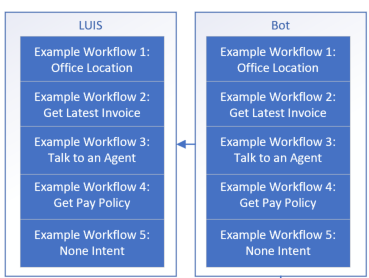
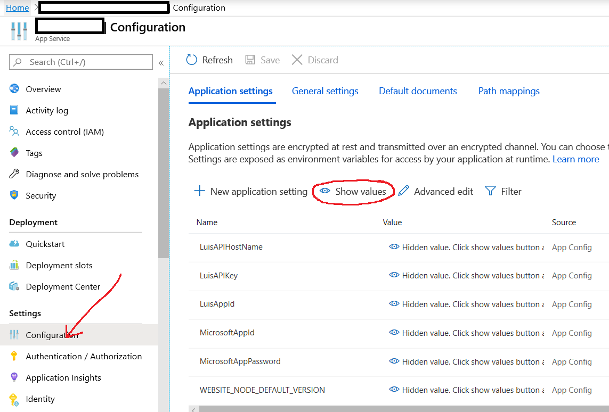
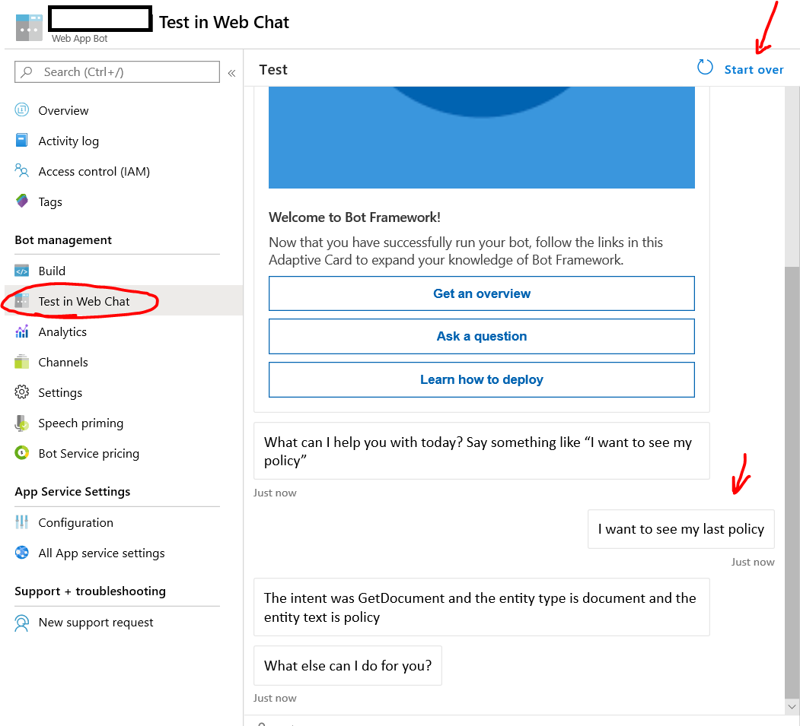

## Deploy LUIS Bot

Assuming we have an idea of what intents (and potentially entities) we'd like to detect, we can look into training a LUIS model using the portal.

We can utilize this [Getting Starting](https://docs.microsoft.com/en-us/azure/cognitive-services/luis/get-started-portal-build-app) guide for creating a LUIS model in the portal.

We'll want to make sure that we can deploy the LUIS model with the corresponding Core bot for testing.

### Helpful Links
1. [Getting Started With LUIS](https://docs.microsoft.com/en-us/azure/cognitive-services/luis/get-started-portal-build-app)
1. [Tutorial for LUIS with C# Bot Framework](https://docs.microsoft.com/en-us/azure/cognitive-services/luis/luis-csharp-tutorial-bf-v4)
1. [LUIS Best Practices Guidance](https://docs.microsoft.com/en-us/azure/cognitive-services/luis/luis-concept-best-practices#do-leverage-the-suggest-feature-for-active-learning)
1. [Intents](https://docs.microsoft.com/en-us/azure/cognitive-services/luis/luis-concept-intent)
1. [Utterances](https://docs.microsoft.com/en-us/azure/cognitive-services/luis/luis-concept-utterance)
1. [Entities](https://docs.microsoft.com/en-us/azure/cognitive-services/luis/luis-concept-entity-types)
1. [LUIS Development Lifecycle](https://docs.microsoft.com/en-us/azure/cognitive-services/luis/luis-concept-app-iteration)
1. [Active Learning](https://docs.microsoft.com/en-us/azure/cognitive-services/luis/luis-concept-review-endpoint-utterances)
1. [Review Endpoint Utterances](https://docs.microsoft.com/en-us/azure/cognitive-services/luis/luis-how-to-review-endpoint-utterances)
1. [LUIS Docker Containers](https://docs.microsoft.com/en-us/azure/cognitive-services/LUIS/luis-container-howto?tabs=v3)
1. [Bot Framework Emulator](https://docs.microsoft.com/en-us/azure/bot-service/bot-service-debug-emulator?view=azure-bot-service-4.0&tabs=csharp)
1. [LUIS App Iteratiion](https://docs.microsoft.com/en-us/azure/cognitive-services/LUIS/luis-concept-app-iteration)
1. [Creating a new version for each cycle](https://docs.microsoft.com/en-us/azure/cognitive-services/LUIS/luis-concept-app-iteration#create-a-new-version-for-each-cycle)
1. [Importing and Exporting the LUIS Model](https://docs.microsoft.com/en-us/azure/cognitive-services/LUIS/luis-concept-app-iteration#import-and-export-a-version)
1. [Using Publish Slots](https://docs.microsoft.com/en-us/azure/cognitive-services/LUIS/luis-concept-app-iteration#publishing-slots)
1. [Bot Framework CLI](https://github.com/microsoft/botframework-cli)
1. [LUIS API](https://westus.dev.cognitive.microsoft.com/docs/services/5890b47c39e2bb17b84a55ff/operations/58aeface39e2bb03dcd5909e)
1. [Azure CLI](https://docs.microsoft.com/en-us/cli/azure/query-azure-cli?view=azure-cli-latest)
1. [Deploy Bot](https://docs.microsoft.com/en-us/azure/bot-service/bot-builder-deploy-az-cli?view=azure-bot-service-4.0&tabs=csharp)
1. [Zip a File](https://devblogs.microsoft.com/scripting/use-powershell-to-create-zip-archive-of-folder/)
1. [Sample LUIS ARM Template](https://github.com/microsoft/LUIS-Samples/blob/master/azuredeploy.json)


#### Reminder on the Sample

For example, suppose we want to detect some intents like location, get invoice, talk to an agent, or get pay policy.



We'll use the sample LUIS model that contains these examples.  For more information on LUIS, it may be helpful to start with [Training a LUiS Model in the Portal](./README-Luis-Training-Portal.md).

### Deploying LUIS and a Bot

#### Read this first!

Take a look at this [Deploy your Bot](https://docs.microsoft.com/en-us/azure/bot-service/bot-builder-deploy-az-cli?view=azure-bot-service-4.0&tabs=csharp) doc, as it contains plenty of guidance which we'll pull into a script.  Of course, this can be further enhanced through CI/CD pipelines and tooling, but this is a sample for how we can deploy LUIS and a bot.

For this scenario, we'll be use scripting and ARM templates.

We're going to assume that we have:
1. [Bot Framework CLI](https://github.com/microsoft/botframework-cli)
1. [Azure CLI](https://docs.microsoft.com/en-us/cli/azure/query-azure-cli?view=azure-cli-latest)
1. [LUIS API](https://westus.dev.cognitive.microsoft.com/docs/services/5890b47c39e2bb17b84a55ff/operations/58aeface39e2bb03dcd5909e)

For the LUIS API access, this will depend on provisioning the LUIS application.

From the project, make sure we can access the following from an administrative PowerShell console:

1. [Sample LUIS Model](../Scenarios/Scenario-LUIS-CSharp-Office-Bot/Sample-Models/luis-office-bot_vLOB-Intents-Entities-0.1.2.json)
1. [Deployment script](../Scenarios/Scenario-LUIS-CSharp-Office-Bot/Sample-Scripts/deploy.ps1)
1. [Template ARM File](../Scenarios/Scenario-LUIS-CSharp-Office-Bot/Sample-Templates/template.json)
1. [Parameters ARM File](../Scenarios/Scenario-LUIS-CSharp-Office-Bot/Sample-Templates/parameters.json)

The template is based off of the [Sample LUIS ARM Template](https://github.com/microsoft/LUIS-Samples/blob/master/azuredeploy.json).

#### Deploy components

We'll want to be in the repo root directory.  And we'll also want to fill in some details on the script:

```powershell
$botName = "mybot"
$location = "westus"
$rgName = "$botName-rg"
$luisAccountName = "luis-$botName"
$tempParams = "parameters.temp.json"
$parametersPath = ".\Scenarios\Scenario-LUIS-CSharp-Office-Bot\Sample-Templates\parameters.json"
$templatePath = ".\Scenarios\Scenario-LUIS-CSharp-Office-Bot\Sample-Templates\template.json"
$codeDir = ".\Scenarios\Scenario-LUIS-CSharp-Office-Bot"
$projFileName = "CoreBot.csproj"
```

These should line up relative to the repo root directory.  If not, make sure that the script has the updated paths included.

Further, there's some API testing we can use too.  Make sure these settings reflect the appropriate location:

```powershell
$luisRestAPIUrl = "https://westus.api.cognitive.microsoft.com/luis/api/v2.0"
$modelFileName = ".\Scenarios\Scenario-LUIS-CSharp-Office-Bot\Sample-Models\luis-office-bot_vLOB-Intents-Entities-0.1.2.json"
$testQuery = "Can you share with me my last pay slip?"
```

Notice that there's a test query, which we can use for testing against the LUIS model.

Make sure we login to Azure and have the appropriate subscription set.

```powershell
az login
az account show
```

Create a resource group for the deployment:

```powershell
az group create -n $rgName -l $location
```

Create an Azure AD App registration.  See the [Bot Deployment Notes](https://docs.microsoft.com/en-us/azure/bot-service/bot-builder-deploy-az-cli?view=azure-bot-service-4.0&tabs=csharp#3-create-the-application-registration) for further details.  We'll also reset the credential password.

```powershell
$appRegistrationJson = $(az ad app create --display-name $botName --key-type Password --available-to-other-tenants "true")
$appId = $($appRegistrationJson | ConvertFrom-Json).appId
$credObject = $(az ad app credential reset --id $appId) | ConvertFrom-Json
```

We're also going to deploy based on **updated parameters**, see the [deployment script](../Scenarios/Scenario-LUIS-CSharp-Office-Bot/Sample-Scripts/deploy.ps1) for more details.  We're replacing some parameters in the file and pass that along to the following command:

```powershell
az group deployment create --name mydeploy --resource-group $rgName --parameters $tempParams --template-file $templatePath
```

#### Deploy LUIS Application 

We can use the following to import the LUIS application.  Again, please refer to the [deployment script](../Scenarios/Scenario-LUIS-CSharp-Office-Bot/Sample-Scripts/deploy.ps1) to get more details on populating these values.

```powershell
bf luis:application:import --endpoint $location --subscriptionKey $LuisAPIKey --name $luisAccountName --in $modelFileName
```

We can also train and check on the status of the LUIS model.

```powershell
bf luis:train:run --endpoint $location --subscriptionKey $LuisAPIKey --appId $luisAppId --versionId $luisModelObject.versionId
bf luis:train:show --endpoint $location --subscriptionKey $LuisAPIKey --appId $luisAppId --versionId $luisModelObject.versionId
```

In the context of the script, we try something simple to check on the status (e.g. polling the status).

Next, we can update the web app settings associated with the bot.  In this case, we'll populate LUIS settings.

```powershell
az webapp config appsettings set -g $rgName -n $botName --settings "LuisAPIKey=$LuisAPIKey"
az webapp config appsettings set -g $rgName -n $botName --settings "LuisAppId=$LuisAppId"
#just need location as hostname.
az webapp config appsettings set -g $rgName -n $botName --settings "LuisAPIHostName=$location"
```

We can publish the model to staging, and also run a test query against the staging slot for LUIS.

```powershell
bf luis:application:publish --endpoint $location --subscriptionKey $LuisAPIKey --versionId $luisModelObject.versionId --appId $LuisAppId --staging
bf luis:application:query --endpoint $location --subscriptionKey $LuisAPIKey --appId $LuisAppId --query $testQuery --staging
```

Assuming we're satisfied with the staging version of the model, let's take some steps towards production slot.

We can set the LUIS model to have a public endpoint.  This depends on having access to the endpoint and of course the appropriate API Key.  Please also check the [LUIS Rest API](https://westus.dev.cognitive.microsoft.com/docs/services/5890b47c39e2bb17b84a55ff/operations/58aeface39e2bb03dcd5909e).

> Note, this is for testing purposes.  In the case that LUIS doesn't need a public endpoint, please do not enable this, and instead think about service to service calls or VNET integrated calls.

```powershell
$luisRestAPIUrl = "https://westus.api.cognitive.microsoft.com/luis/api/v2.0"
$appSettingsUrl = "$luisRestAPIUrl/apps/$LuisAppId/settings"
Invoke-WebRequest "$appSettingsUrl" -Headers  @{ "Ocp-Apim-Subscription-Key" = "$LuisAPIKey" } -Body (ConvertTo-Json @{ "public"=$true}) -Method PUT -ContentType 'application/json'
```

We can publish the model to the production slot and then run a test query against the production slot for LUIS.

```powershell
bf luis:application:publish --endpoint $location --subscriptionKey $LuisAPIKey --versionId $luisModelObject.versionId --appId $LuisAppId
bf luis:application:query --endpoint $location --subscriptionKey $LuisAPIKey --appId $LuisAppId --query $testQuery
```

#### Deploy the bot

In the case of a C# bot, we'll use Azure CLI to prepare the bot environment.
> Note, this will create a .deployment file in the bot code folder.  In the script we move the existing one, but this is a consideration that the .deployment file will be used as part of deploying the bot.

```powershell
az bot prepare-deploy --lang Csharp --code-dir $codeDir --proj-file-path $projFileName
```

Next, we want to zip the bot code directory.  When we zip this in the script, the **destination folder** cannot be a child of the **source folder**.  The contents of this will be zipped up for deployment.

Please refer to this PowerShell sample for [Creating a zip archive of a folder](https://devblogs.microsoft.com/scripting/use-powershell-to-create-zip-archive-of-folder/).

```powershell
$workingDirectory = Get-Location | select -ExpandProperty Path
$source = "$workingDirectory\$codeDir"
$destinationFolder = "$workingDirectory\$codeDir-deployment" #cannot be part of the source folder.
$destinationPath = "$destinationFolder\$botName.zip"

mkdir $destinationFolder -Force

If(Test-path $destinationPath) 
{
    Remove-item $destinationPath
}

Add-Type -assembly "system.io.compression.filesystem"
[io.compression.zipfile]::CreateFromDirectory($Source, $destinationPath)
```

We can now publish the bot .zip file.

```powershell
az webapp deployment source config-zip -g $rgName --name $botName --src $destinationPath
```

### Test Web Chat Bot

Let's first check that the bot has the appropriate Azure App Settings configured.



| Setting | Description |
|:---|:---|
| LuisAPIHostName | The LUIS API Host name, in the form of **Location**.api.cognitive.microsoft.com.  For example, **westus**.api.cognitive.microsoft.com would use **westus**.  This also depends on bot implementation. |
| LuisAPIKey | The API key.  Note that in the luis portal (https://luis.ai), this key is a 
GUID without the dashes. |
| LuisAppID | This is a GUID for the LUIS Application ID. |
| MicrosoftAppId | This is the Azure AD App registration ID GUID. |
| MicrosoftAppPassword | This is the Azure AD App registration password. |
| WEBSITE_NODE_DEFAULT_VERSION | Applicable for Node.js bots. |

In the Azure Portal, we can navigate to the Bot Service and check on the 'Test in Web Chat'.

Assuming can load the bot (and the appropriate settings are in place), we should see the bot load for some testing.



### Clean up

Please remember to clean up the resource group that is holds the components.

```powershell
az group delete -g $rgName
```

Also, be sure to clean up the Azure AD App registration.

```powershell
az ad app delete --id $appId
```