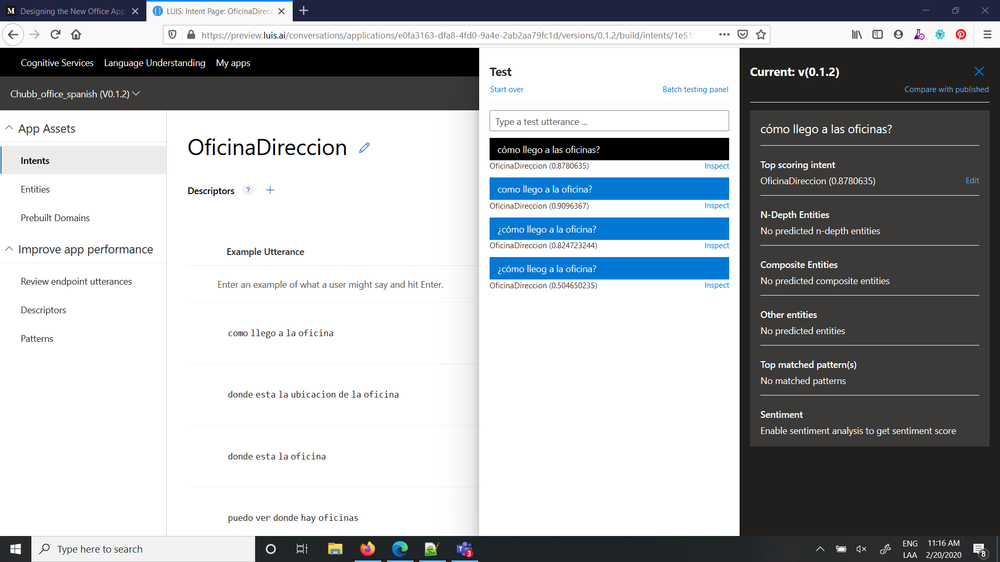

## LUIS Spanish recomendatoins

Dealing with LUIS models, rules and tools is one part of the job but we also need to focus in the language we're going to use because it will be useful to get some tips that will lead us to increase the score results.

In Mexican Spanish we use accents and also we have question or exclamation marks when needed. In this document we can work on the best way to get this done and how to handle it in the best possible way.

Look at the following sample:

|Planned intent|Most common intent|
|-------------|----------------|
|¿Dónde está la oficina?|Donde esta la oficina?|

So the best way to handle this is by deleting accents and marks in the intents like de following.

|Correct word|Average intent|
|------------|--------------|
|¿Cómo?|Como?|
|¿Quién|Quien?|
|¡Quiero comer!|Quiero comer!|

This case will lead to higher scores and also will be able to control both cases. Adding accents and marks can dramatically reduce the chance to get a correct result.

