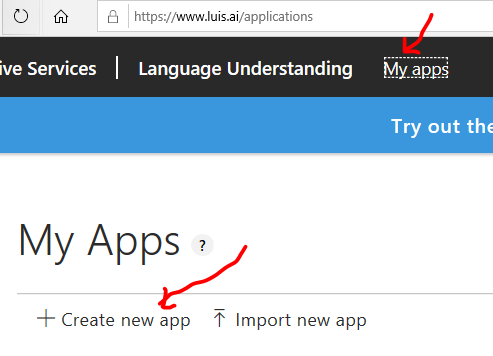
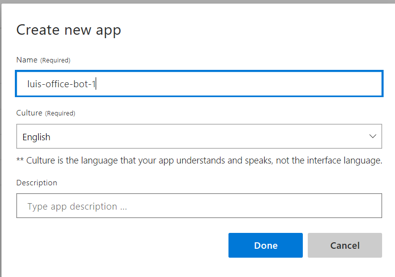
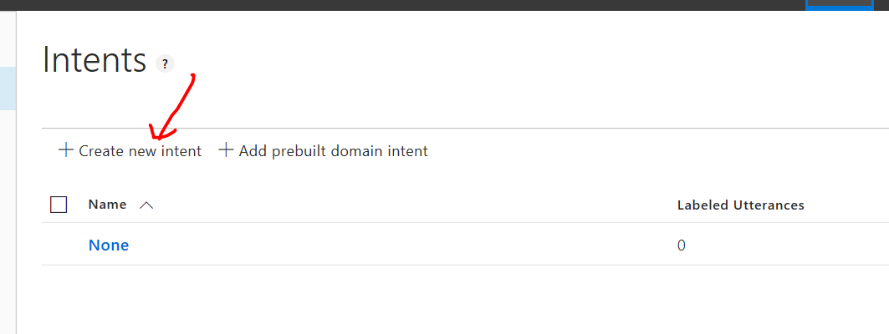
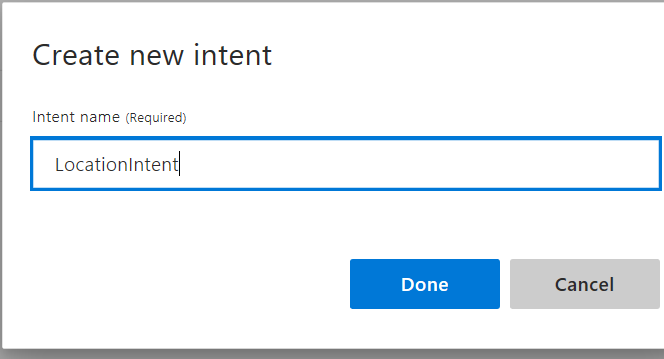
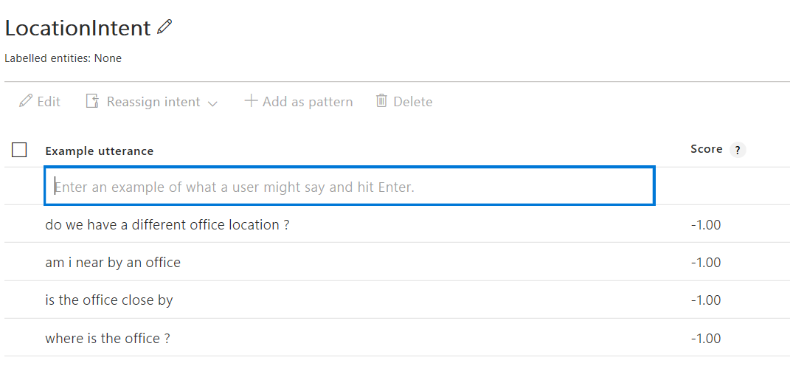
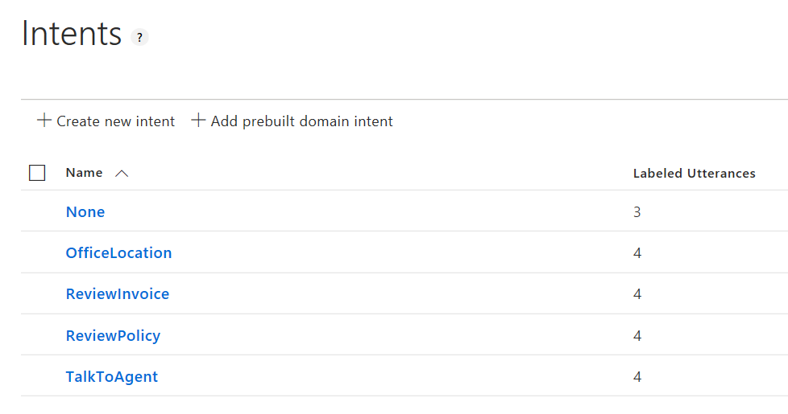
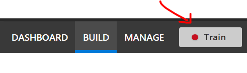
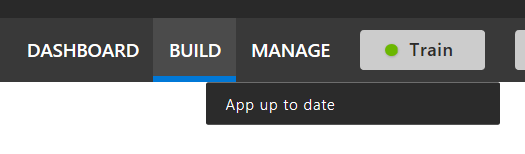

## LUIS Model Training in the Portal

Assuming we have an idea of what intents (and potentially entities) we'd like to detect, we can look into training a LUIS model using the portal.

We can utilize this [Getting Starting](https://docs.microsoft.com/en-us/azure/cognitive-services/luis/get-started-portal-build-app) guide for creating a LUIS model in the portal.

### Helpful Links
1. [Getting Started With LUIS](https://docs.microsoft.com/en-us/azure/cognitive-services/luis/get-started-portal-build-app)
1. [Intents](https://docs.microsoft.com/en-us/azure/cognitive-services/luis/luis-concept-intent)
1. [Utterances](https://docs.microsoft.com/en-us/azure/cognitive-services/luis/luis-concept-utterance)
1. [Entities](https://docs.microsoft.com/en-us/azure/cognitive-services/luis/luis-concept-entity-types)
1. [LUIS Development Lifecycle](https://docs.microsoft.com/en-us/azure/cognitive-services/luis/luis-concept-app-iteration)

### Setup LUIS Model

#### Some Concepts and Design

First, determine some example [Utterances](https://docs.microsoft.com/en-us/azure/cognitive-services/luis/luis-concept-utterance), [Intents](https://docs.microsoft.com/en-us/azure/cognitive-services/luis/luis-concept-intent), and even [Entities](https://docs.microsoft.com/en-us/azure/cognitive-services/luis/luis-concept-entity-types).  In this scenario, we'll start simple with some **utterances** and **intents** we'd like LUIS to detect.

For example, suppose we want to detect some intents like location, get invoice, talk to an agent, or get pay policy.

It would also be helpful to think about representative utterances (e.g. this is what a user will send to a LUIS model through a chatbot) to populate the LUIS model.  We can use these utterances when we create the LUIS model.

#### Create LUIS Model

We can create a LUIS Model based on the [Getting Started With LUIS](https://docs.microsoft.com/en-us/azure/cognitive-services/luis/get-started-portal-build-app) guide.

Login to https://wwww.luis.ai.  The credentials should be tied to an Azure subscription.

Once logged in, navigate to the 'My Apps' and create a new app.

We can fill in the details for a new LUIS model.  We can also select a different language besides the default.

#### Build the Model

We can now look into building the model.

Let's add an Intent.

We can provide the name for the intent.

Once we have the intent name, we can provide example [utterances](https://docs.microsoft.com/en-us/azure/cognitive-services/luis/luis-concept-utterance).

> From the doc: Utterances are input from the user that your app needs to interpret. To train LUIS to extract intents and entities from them, it's important to capture a variety of different example utterances for each intent. Active learning, or the process of continuing to train on new utterances, is essential to machine-learned intelligence that LUIS provides.
Collect utterances that you think users will enter. Include utterances, which mean the same thing but are constructed in a variety of different ways.

Once we add these utterances to the intent, we can repeat the process and additional intents / utterances.

Once satisifed, we can then look into training the model.

> Note that with the None Intent, we can add examples that do not match the other intents.  Example utterances with the None intent will affect the confidence score for the other intents with LUIS.

Once training is complete, we should see that the LUIS App is up to date.

> The process of updating the model (intents, utterances, entities, etc.) and then retraining will affect how the model scores new inputs.  It is helpful to make sure that the model's performance is revisited, especially with the appropriate content author.