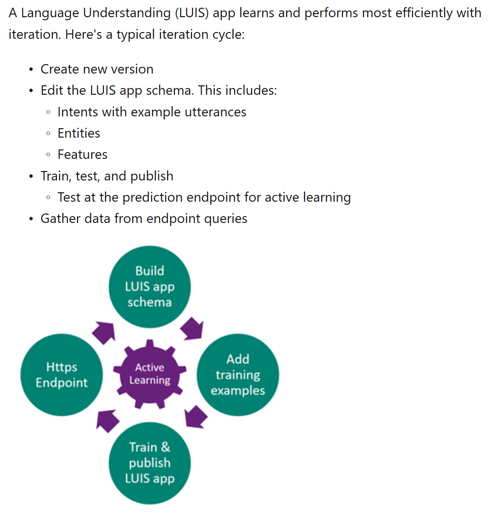

## Manage Model Versions

Assuming we have an idea of what intents (and potentially entities) we'd like to detect, we can look into training a LUIS model using the portal.

We can utilize this [Getting Starting](https://docs.microsoft.com/en-us/azure/cognitive-services/luis/get-started-portal-build-app) guide for creating a LUIS model in the portal.

The main concept here from the [LUIS Best Practices Guidance](https://docs.microsoft.com/en-us/azure/cognitive-services/luis/luis-concept-best-practices#do-build-your-app-iteratively-with-versions):
> Each authoring cycle should be within a new version, cloned from an existing version.

### Helpful Links
1. [Getting Started With LUIS](https://docs.microsoft.com/en-us/azure/cognitive-services/luis/get-started-portal-build-app)
1. [LUIS Best Practices Guidance](https://docs.microsoft.com/en-us/azure/cognitive-services/luis/luis-concept-best-practices#do-leverage-the-suggest-feature-for-active-learning)
1. [Intents](https://docs.microsoft.com/en-us/azure/cognitive-services/luis/luis-concept-intent)
1. [Utterances](https://docs.microsoft.com/en-us/azure/cognitive-services/luis/luis-concept-utterance)
1. [Entities](https://docs.microsoft.com/en-us/azure/cognitive-services/luis/luis-concept-entity-types)
1. [LUIS Development Lifecycle](https://docs.microsoft.com/en-us/azure/cognitive-services/luis/luis-concept-app-iteration)
1. [Active Learning](https://docs.microsoft.com/en-us/azure/cognitive-services/luis/luis-concept-review-endpoint-utterances)
1. [Review Endpoint Utterances](https://docs.microsoft.com/en-us/azure/cognitive-services/luis/luis-how-to-review-endpoint-utterances)
1. [LUIS Docker Containers](https://docs.microsoft.com/en-us/azure/cognitive-services/LUIS/luis-container-howto?tabs=v3)
1. [Bot Framework Emulator](https://docs.microsoft.com/en-us/azure/bot-service/bot-service-debug-emulator?view=azure-bot-service-4.0&tabs=csharp)
1. [LUIS App Iteratiion](https://docs.microsoft.com/en-us/azure/cognitive-services/LUIS/luis-concept-app-iteration)
1. [Creating a new version for each cycle](https://docs.microsoft.com/en-us/azure/cognitive-services/LUIS/luis-concept-app-iteration#create-a-new-version-for-each-cycle)
1. [Importing and Exporting the LUIS Model](https://docs.microsoft.com/en-us/azure/cognitive-services/LUIS/luis-concept-app-iteration#import-and-export-a-version)
1. [Using Publish Slots](https://docs.microsoft.com/en-us/azure/cognitive-services/LUIS/luis-concept-app-iteration#publishing-slots)
1. [Bot Framework CLI](https://github.com/microsoft/botframework-cli)

### Setup LUIS Model

We have included a sample LUIS model, but we'll assume that we're going to start with a brand new one.

#### Reminder on the Sample

For example, suppose we want to detect some intents like location, get invoice, talk to an agent, or get pay policy.


It would also be helpful to think about representative utterances (e.g. this is what a user will send to a LUIS model through a chatbot) to populate the LUIS model.  We can use these utterances when we create the LUIS model.

#### Some Concepts and Design

First, determine some example [Utterances](https://docs.microsoft.com/en-us/azure/cognitive-services/luis/luis-concept-utterance), [Intents](https://docs.microsoft.com/en-us/azure/cognitive-services/luis/luis-concept-intent), and even [Entities](https://docs.microsoft.com/en-us/azure/cognitive-services/luis/luis-concept-entity-types).  In this scenario, we'll start simple with some **utterances** and **intents** we'd like LUIS to detect.

We should understand a typical LUIS authoring life cycle.


Notice that we can have this cycle of creating a version of an app, adding training examples, training and publishing, and then making sure to review the https endpoint utterances.  As we start modifying the LUIS app, it is possible to change these in the portal, but it is also helpful to keep track of prior versions.

From this section on [Creating a new version for each cycle](https://docs.microsoft.com/en-us/azure/cognitive-services/LUIS/luis-concept-app-iteration#create-a-new-version-for-each-cycle):

> Each version is a snapshot in time of the LUIS app. Before you make changes to the app, create a new version. It is easier to go back to an older version than to try to remove intents and utterances to a previous state.
The version ID consists of characters, digits or '.' and cannot be longer than 10 characters.
The initial version (0.1) is the default active version.

#### Creating a new version

We can either **clone** the existing model in the portal, or we can use a **file representation** of the model.

> Clone an existing version to use as a starting point for each new version. After you clone a version, the new version becomes the active version.

File versions can be handled through [Importing and Exporting the LUIS Model](https://docs.microsoft.com/en-us/azure/cognitive-services/LUIS/luis-concept-app-iteration#import-and-export-a-version).

Let's try to export our existing LUIS model as a **JSON file**.


Suppose we have already [Reviewed Endpoint Utterances](./README-Review-Endpoint-Utterances.md) and noticed some utterances from end users that we can now map to some intents.

While we can add the intent directly in the portal (and then export the model), we can also modify a copy of the local file which represents the snapshot of the LUIS model from our export earlier.

We can increment our version:
```json
{
  "luis_schema_version": "4.0.0",
  "versionId": "0.1.1",
  ...
}
```

For example, we can add an intent to the intents array:
```json
    ...
     "intents": [
    ...
    {
      "text": "hey I want some pizza",
      "intent": "None",
      "entities": []
    },
    ...
    ]
    ...
```

Or we can even add in entities ([importing a LUIS Model version](https://docs.microsoft.com/en-us/azure/cognitive-services/LUIS/luis-concept-app-iteration#import-and-export-a-version) with an [Entities Sample](../Scenarios/Scenario-LUIS-CSharp-Office-Bot/Sample-Models/luis-office-bot_vLOB-Intents-Entities-0.1.json)).

> In this case, we can capture not only **intents**, but also **entities** which will help provide additional guidance for the intent.

Now that we have the changes, we can take a few different approaches.

#### Publish Manually

The **simple path** is is to just upload the modified file as a new version of the model.  This is the import step.


Notice that if we select a new version, then the model will be shown as active.

However, we would still need to publish the LUIS model to a [Publish Slot](https://docs.microsoft.com/en-us/azure/cognitive-services/LUIS/luis-concept-app-iteration#publishing-slots).  From the doc:

> You can publish to either the stage and/or production slots. Each slot can have a different version or the same version. This is useful for verifying changes before publishing to production, which is available to bots or other LUIS calling apps.  Trained versions aren't automatically available at your LUIS app's endpoint. You must publish or republish a version in order for it to be available at your LUIS app endpoint.

Suppose we're using the new version of the model that we have imported.

It's also worth revisiting the **test console** in the LUIS portal to compare the imported version results with the one that is already published.


Click on compare with published.


#### Publish Automatically (An Approach)

Going back to the idea that we have files, we could look into CI/CD as well assuming that we have appropriate agent connectivity, testing, and source control.

<<<<<<< HEAD
> This would be a much more involved approach, but would be more representative of a production scenario.  We'll look at a possible key step that will help this scenario work.

We could use the [Bot Framework CLI](https://github.com/microsoft/botframework-cli) and test this first locally with the file, but ultimately this could live in a script task that runs on an agent that will deploy built artifacts (e.g. Azure DevOps build / release pipelines)

```powershell
bf luis:version:import --endpoint {ENDPOINT} --subscriptionKey {SUBSCRIPTION_KEY} --appId
  {APP_ID} --in {PATH_TO_JSON} --versionId {VERSION_ID}
```

This approach could also involve other SDKs or APIs, but of course this depends on familiarity and validating that the underlying calls will work. 
=======
> This would be a much more involved approach, but would be more representative of a production scenario.  We'll look at a possible key step that will help this scenario work.  This approach could also involve other SDKs or APIs, but of course this depends on familiarity and validating that the underlying calls will work. 

As a test, we could use the [Bot Framework CLI](https://github.com/microsoft/botframework-cli) and test this first locally with the file, but ultimately this could live in a script task that runs on an agent that will deploy built artifacts (e.g. Azure DevOps build / release pipelines)

For example, suppose we update the **VersionId** in the JSON file as part a change in the model.


Next, we can use a [Bot Framework CLI](https://github.com/microsoft/botframework-cli) to import the model from a file.

```powershell
bf luis:version:import --endpoint $location --subscriptionKey $subKey --appId $appId --in $modelFilePath --versionId $versionId
```

We can run this command to import the model.


We can now check to see the model was imported in the portal as well by looking at the versions for the model.


After importing the model, we'll need to make sure to train the model.


We can see this in two steps - run and show.

```powershell
bf luis:train:run --endpoint $location --subscriptionKey $subKey --appId $appId --versionId $versionId
bf luis:train:show --endpoint $location --subscriptionKey $subKey --appId $appId --versionId $versionId
```

We can run training.


We can also show how the training is proceeding.


We can check in the [LUIS Portal](https://luis.ai) to see that the model was imported and now trained.


Once satisfied with training, we can also test the model.
> This is will allow us to test against the model before publishing.  We'll borrow the batch testing file as input.

For convenience, this is wrapped in the [sample batch file test script](..\Scenarios\Scenario-LUIS-CSharp-Office-Bot\Sample-Scripts\SampleTestFile.ps1).

Be sure to supply values in the script as appropiate for testing the version of the model that we had just imported.

```powershell
$location = "westus" #set to LUIS endpoint host
$subscriptionKey = "" #set to LUIS App Key
$appId = "" #set to LUIS App Id
$versionId = "" #set to LUIS Version Id
$batchFilePath = "" #set to file path for the Batch Test File
```

If we run the script in the location where the host can reach [Get-LUISResult](..\Scenarios\Scenario-LUIS-CSharp-Office-Bot\Sample-Scripts\Get-LUISResult.ps1), the input batch test file (see this [sample batch test](..\Scenarios\Scenario-LUIS-CSharp-Office-Bot\Sample-Batch-Tests\luis-office-bot-batch-test.json)), and we have supplied the appropriate credentials and have network access, we should be able to see results that reflect the queries against the LUIS model.


> From an automation standpoint, we can also look into including additional tests in a test suite that we can run on the model in our CI/CD pipelines.  This can be something that is revisited by the team and also later be updated based on results seen in live usage for LUIS.

We can then look into publishing the model.  We can publish to staging slot as a starting point.

```powershell
bf luis:application:publish --endpoint $location --subscriptionKey $subKey --versionId $versionId --appId $appId --staging
```


We can also send some sample queries to LUIS to validate that we're getting expected results.

> While we can use **luis:application:query**, it looks like as of now, **batch testing** with LUIS is not yet available.

```powershell
bf luis:application:query --endpoint $location --subscriptionKey $subKey --appId $appId --query "Can you share with my last pay slip" --staging
```


If needed, we could script various tests to run against the staging slot, and this could roll up as part of the pipeline.

If we're satisified with the performance of the LUIS model, we can also publish the model to the production slot.

```powershell
bf luis:application:publish --endpoint $location --subscriptionKey $subKey --versionId $versionId --appId $appId
```


Again, we could also run the queries to validate that the production slot works.

> Again, batch testing could also be used (and isn't yet available right now with **bf cli**), but this will could be used as part of an end to end test as well.

```powershell
bf luis:application:query --endpoint $location --subscriptionKey $subKey --appId $appId --query "Can you share with my last pay slip" 
```


>>>>>>> ca573ba315df115a9daa16f9bbffac06e942a604
