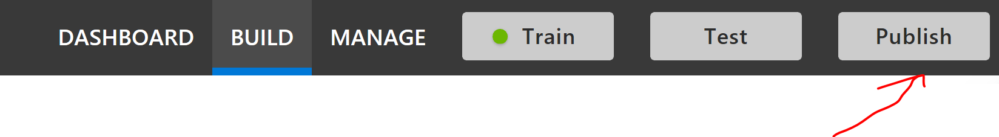

## Review Endpoint Utterances

Assuming we have an idea of what intents (and potentially entities) we'd like to detect, we can look into training a LUIS model using the portal.

We can utilize this [Getting Starting](https://docs.microsoft.com/en-us/azure/cognitive-services/luis/get-started-portal-build-app) guide for creating a LUIS model in the portal.

The main concept here from the [LUIS Best Practices Guidance](https://docs.microsoft.com/en-us/azure/cognitive-services/luis/luis-concept-best-practices#do-leverage-the-suggest-feature-for-active-learning):
> Use active learning's Review endpoint utterances on a regular basis, instead of adding more example utterances to intents. Because the app is constantly receiving endpoint utterances, this list is growing and changing.

### Helpful Links
1. [Getting Started With LUIS](https://docs.microsoft.com/en-us/azure/cognitive-services/luis/get-started-portal-build-app)
1. [LUIS Best Practices Guidance](https://docs.microsoft.com/en-us/azure/cognitive-services/luis/luis-concept-best-practices#do-leverage-the-suggest-feature-for-active-learning)
1. [Intents](https://docs.microsoft.com/en-us/azure/cognitive-services/luis/luis-concept-intent)
1. [Utterances](https://docs.microsoft.com/en-us/azure/cognitive-services/luis/luis-concept-utterance)
1. [Entities](https://docs.microsoft.com/en-us/azure/cognitive-services/luis/luis-concept-entity-types)
1. [LUIS Development Lifecycle](https://docs.microsoft.com/en-us/azure/cognitive-services/luis/luis-concept-app-iteration)
1. [Active Learning](https://docs.microsoft.com/en-us/azure/cognitive-services/luis/luis-concept-review-endpoint-utterances)
1. [Review Endpoint Utterances](https://docs.microsoft.com/en-us/azure/cognitive-services/luis/luis-how-to-review-endpoint-utterances)
1. [LUIS Docker Containers](https://docs.microsoft.com/en-us/azure/cognitive-services/LUIS/luis-container-howto?tabs=v3)
1. [Bot Framework Emulator](https://docs.microsoft.com/en-us/azure/bot-service/bot-service-debug-emulator?view=azure-bot-service-4.0&tabs=csharp)
### Setup LUIS Model

We have included a sample LUIS model, but we'll assume that we're going to start with a brand new one.

#### Some Concepts and Design

First, determine some example [Utterances](https://docs.microsoft.com/en-us/azure/cognitive-services/luis/luis-concept-utterance), [Intents](https://docs.microsoft.com/en-us/azure/cognitive-services/luis/luis-concept-intent), and even [Entities](https://docs.microsoft.com/en-us/azure/cognitive-services/luis/luis-concept-entity-types).  In this scenario, we'll start simple with some **utterances** and **intents** we'd like LUIS to detect.

From the doc to [Review Endpoint Utterances](https://docs.microsoft.com/en-us/azure/cognitive-services/luis/luis-concept-review-endpoint-utterances), it's worth understanding what's **Active Learning**:

> Active learning is a two-step process. First, LUIS selects utterances it receives at the app's endpoint that need validation. The second step is performed by the app owner or collaborator to validate the selected utterances for review, including the correct intent and any entities within the intent. After reviewing the utterances, train and publish the app again.

It's also worth noting **where are the utterances from**:

> Endpoint utterances are taken from end-user queries on the application’s HTTP endpoint. If your app is not **published** or has not received hits yet, you do not have any utterances to review. If no endpoint hits are received for a specific intent or entity, you do not have utterances to review that contain them.

For example, suppose we want to detect some intents like location, get invoice, talk to an agent, or get pay policy.

It would also be helpful to think about representative utterances (e.g. this is what a user will send to a LUIS model through a chatbot) to populate the LUIS model.  We can use these utterances when we create the LUIS model.

#### Publish Model

Suppose we have already [trained](./README-LUIS-Training-Portal.md) after adding utterances to the model, we should make sure the model is published.

First click the publish button:

Next, select the environment:

We can also make sure to manage the app and check that our LUIS app has a public endpoint.

> We're using the public endpoint for testing purposes.  In a production scenario, we'd want to be sure that this has appropriate network connectivity and authorization.  One choice may be to look into hosting [LUIS Docker Containers](https://docs.microsoft.com/en-us/azure/cognitive-services/LUIS/luis-container-howto?tabs=v3), but this introduces additional operational overhead and architectural considerations.

#### Sending Some Test Messages

We can use the [Bot Framework Emulator](https://docs.microsoft.com/en-us/azure/bot-service/bot-service-debug-emulator?view=azure-bot-service-4.0&tabs=csharp) and run the solution (../Scnarios/Scenario-LUIS-CSharp-Office-Bot/CoreBot.sln) - assumimg we have populated the appropriate bot settings.

> If the bot or LUIS model is accessible to users, we can also see their utterances.  In fact, we may find much more varied requests sent to LUIS than expected.

#### Review Endpoint Utterances

Assuming we have some utterances now sent to the LUIS endpoint, we can look at the endpoint utterances and review what LUIS picked.

We may find that in some cases the model performed as expected, and in others, perhaps the intent is not labelled the way we expected.  In the case where the intent isn't aligned, we can add the utterance to the appropriate intent.

> Note want to be mindful that we keep in mind other considerations for intents, utterances, entities, and patterns; otherwise we may introduce an inbalanced model that will skew predictions.  So, if we start adding more utterances to one intent, we'll want to make sure that the other intents also get more examples too; similarly we'll want to make sure the none intent receives around 10% of the total utterances.  We can re-train the model as well, and also have regular / scehduled endpoint review with the appropriate language domain expert to help guide the model too.  Please see the reference documentation for more guidance.